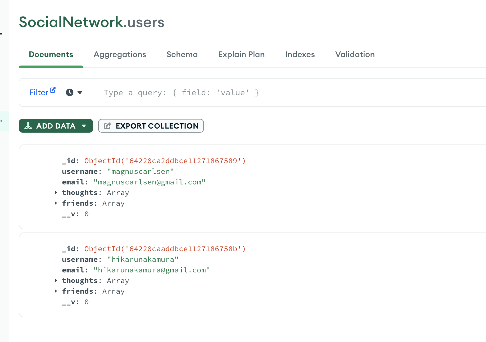
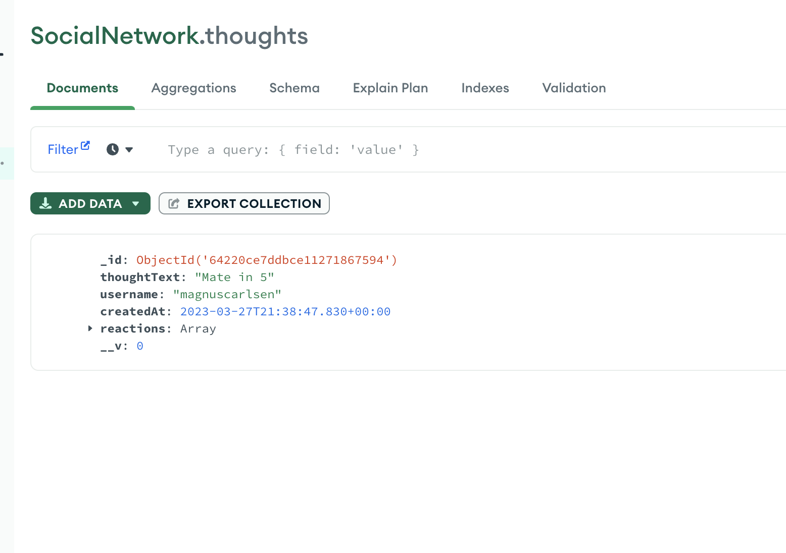
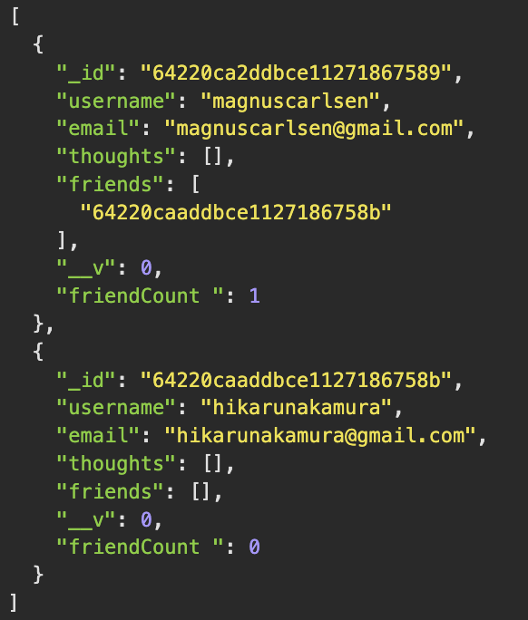

## Social Network NoSQL API
## Description

The purpose of this project was to develop skills and learn the basics of using NoSQL, in this case I used MongoDB and Mongoose. The project entails the backed of a website API where individuals can have a username, an email and with their account they can create thoughts and under those thoughts are reactions, think of like a comment section. During my time coding this project I learnt many things about mongoose such as the query and projection operators.

## Table of Contents

- [Installation](#installation)
- [Usage](#usage)
- [Credits](#credits)
- [License](#license)

## Installation

In order to install this project simply clone the repository and install the dependencies. The dependencies used are: express, mongodb and mongoose. Make sure to have MondoDB installed on your machine before attempting to use the npm packages.
1. Install mongoDB from their website
2. Install dependencies `npm i mongodb`/`npm i express`/`npm i mongoose`
3. Run the app using node. `node server.js`

## Usage

To use the app you simply have to run it using node: `node server.js`. Make sure you have everything installed before attempting to the run the app in the installation section.

Here is what your database should look like if you are successful in installing it.

Here is what your db should look like:

Example of the user JSON:

Here's a video of what the routes should look like: https://www.youtube.com/watch?v=oWtFxp0o1L8 

